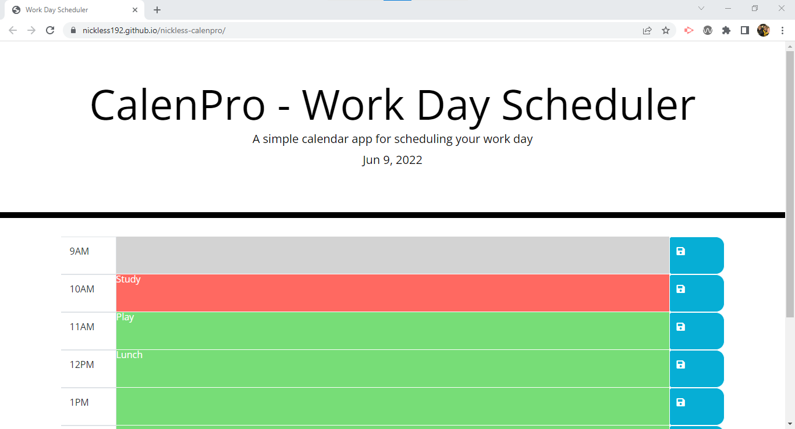

# Work Day Scheduler Starter Code

## Description
Nickless CalenPro allows you to view your daily set tasks from 9am to 5pm. The current date will be displayed on top at all times. Color-coding allows you to determine your progress through the day:

* Tasks in grey are already in the past;

* Tasks in red at being executed at the moment or require inmediate attention;

* Tasks in green will be executed in the future.

By clicking on the task box for a specific time will turn it into an text area element to allow for modifications of the task descrition. At this moment, if the Save button is pressed, then the text is saved to the page and to the localStorage.

## User Story

AS AN employee with a busy schedule  
I WANT to add important events to a daily planner  
SO THAT I can manage my time effectively

## Acceptance Criteria

GIVEN I am using a daily planner to create a schedule  
WHEN I open the planner  
THEN the current day is displayed at the top of the calendar  
WHEN I scroll down  
THEN I am presented with time blocks for standard business hours  
WHEN I view the time blocks for that day  
THEN each time block is color-coded to indicate whether it is in the past, present, or future  
WHEN I click into a time block  
THEN I can enter an event  
WHEN I click the save button for that time block  
THEN the text for that event is saved in local storage  
WHEN I refresh the page  
THEN the saved events persist

## Screenshot of Deployed Site

## Links

GitHub link: https://github.com/nickless192/nickless-calenpro

Deployed Page: https://nickless192.github.io/nickless-calenpro/

## Contributors

Made with ❤️ by Nickless192 (Omar Rodriguez)

Also, HTML for save icon found here: https://fontawesome.com/v5/icons/save?s=solid